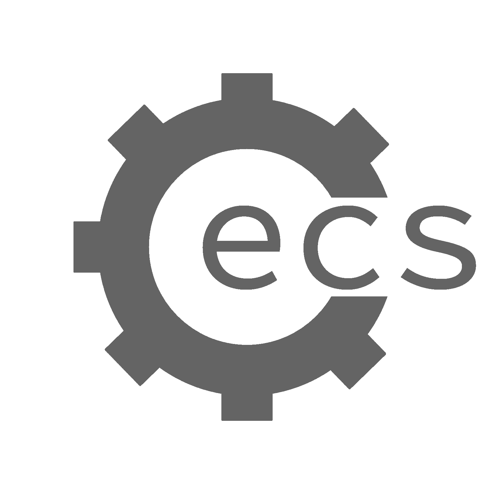

<p align="center">
<br/>
  <br/>
  (sɛks)<br/><br/>
  a small ecs, written in c.<br/>
<br/>
<a href="https://github.com/MatthewOwens/cecs/issues"></a>
</p>

## Summary
small entity-component-system written in C. The purpose of this project is 3-fold:
* brush up on c (again)
* wrap my head around entity-component-systems
* work using [github flow](https://guides.github.com/introduction/flow/)

## Building
1. clone the repo
2. run `make`
3. run `make check` to run unit tests

make install is currently unsupported, as this project is in no fit state
to be installed.

## Usage
to use cecs in your project, you can include the following files:
```c
#include "cecs.h"
#include "cecs_component.h"
#include "cecs_entitiy.h"
#include "cecs_system.h"
```
all cecs functions return a `cecs_errno` enum, defined in `cecs_err.h`
### Components
components are dumb data structures, added to entities and manipulated by systems.
For example:
```c
typedef struct {
	float x;
	float y;
	float z;
} PosComponent;
```
would be registered in cecs like this:
```c
static PosComponent posComp = {0};
cecs_reg_component(cecs, "position", &posComp, sizeof(posComp));
```
`cecs_reg_component` takes four parameters
* a pointer to cecs
* a name to associate the component with
* a pointer to the original var and the size of the original var.

once a component has been registered the original variable and it's associated
location in memory are no longer required. 
### Entities
entities are clusters of components that represent an object in the game.
empty entities are registered with:
```c
static int ent;
cecs_add_entity(cecs, &ent);
```
here the `ent` parameter is a return parameter, the internal ID of the entitiy.
from there, entities can be composed using `cecs_ent_add_component`
```c
cecs_ent_add_component(cecs, ent, "position");
cecs_ent_add_component(cecs, ent, "collision");
```
`cecs_ent_add_component` takes three parameters
* a pointer to cecs
* the internal entitiy ID returned from `cecs_add_entity`
* a component name to add to the entitiy

### Systems
testing & implementation required
